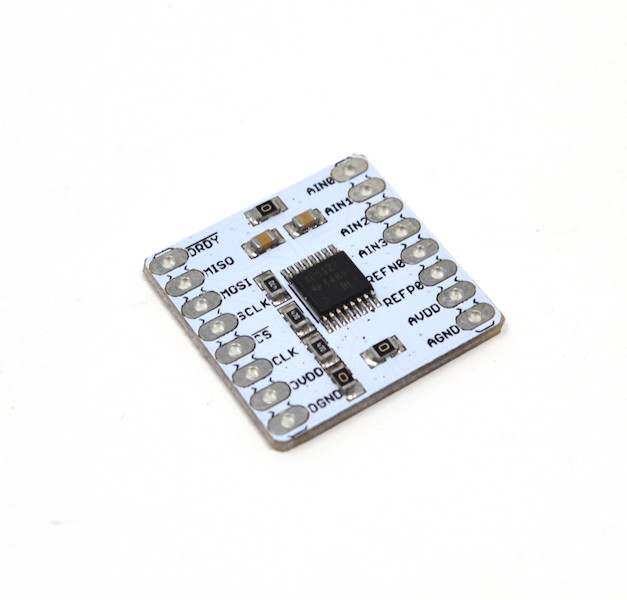

# ProtoCentral ADS1220 24-bit ADC Breakout Board

If you don't already have one, you can buy the ProtoCentral ADS1220 24-bit ADC Breakout Board from:

* [ProtoCentral(Worldwide)](https://www.protocentral.com/analog-adc-boards/773-ads1220-24-bit-4-channel-low-noise-adc-breakout-board.html)

* [ProtoCentral USA](https://protocentral.us/breakout-boards/5-ads1220-24-bit-4-channel-low-noise-adc-breakout-board.html)

Why would you need a 24-bit ADC? When 16-bit is just not enough.
If your design demands high precision analog measurements, this new breakout board for the ADS1220 24-bit Sigma-delta ADC can get the job done.
Most of the previously available 24-bit ADCs have been difficult to use since they require a separate voltage reference and a lot of external components among other things. The ADS1220 gets rid of almost all external components with an internal voltage reference and internal clock. This is one of the easiest to use 24-bit ADCs that we have come across.
We also provide the Arduino libraries for interfacing this chip with your Arduino. To install the library, download the zip file from our github site, rename it to ProtoCentral_ADS1220 and unzip this file in your Arduino libraries folder.

# Features

* Programmable Data Rates: Up to 2 kSPS
* Programmable Gain: 1 V/V to 128 V/V
* Low current : 250 uA
* Low-Noise: 90 nVRMS at 20 SPS

# Applications

* High Precision analog voltage measurement
* RTD interfacing
* High precision chemical sensors

# Wiring to your Arduino

|ADS1220 Pin | Pin Function         |Arduino Uno Pin Connection|
|-----------------|:--------------------:|-----------------:|
| DRDY            | Data ready Output pin|  D6              |             
| MISO            | Slave Out            |  D12             |
| MOSI            | Slave In             |  D11             |
| SCLK            | Serial Clock         |  D13             |
| CS              | Chip Select          |  D7              |
| DVDD            | Digital VDD          |  +5V             |
| DGND            | Digital Gnd          |  Gnd             |
| AN0-AN3         | Analog Input         |  Analog Input    |
| AVDD            | Analog VDD           |  -               |
| AGND            | Analog Gnd           |  -               |

  ** The example sketch is configured for internal Vref=2.048, provide the differential voltage across AN0 and AN1.

# License Information

This product is open source! Both, our hardware and software are open source and licensed under the following licenses:

## Hardware

All hardware is released under [Creative Commons Share-alike 4.0 International](http://creativecommons.org/licenses/by-sa/4.0/).**

## Software

All software is released under the MIT License(http://opensource.org/licenses/MIT).**

Please check [*LICENSE.md*](LICENSE.md) for detailed license descriptions.
